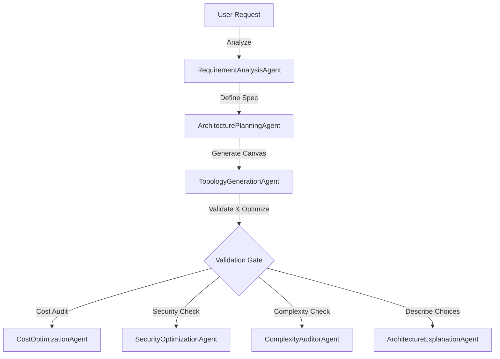

# Architecture & AI Reasoning Service (architecture-service)

The Architecture Service is the central intelligence engine of the ArchGen platform. Built on **FastAPI**, it uses a multi-agent AI pipeline and a rule-based deterministic engine to transform text requirements into standardized cloud topology diagrams (nodes, edges, services), estimate monthly running costs, audit security/compliance, and generate ready-to-run Terraform HCL files.

---

## 1. Core Architecture & Multi-Agent Pipeline

The core API routes are defined in [routes/api.py](file:///c:/Users/Praveen/Desktop/New%20folder/architecture-service/routes/api.py). When a requirement payload is received, the service orchestrates multiple specialized AI agents defined under the `agents/` folder:



### Specialized Agents:
* **RequirementAnalysisAgent** ([requirement_analysis.py](file:///c:/Users/Praveen/Desktop/New%20folder/architecture-service/agents/requirement_analysis.py)): Analyzes text prompts to extract region, budget, compliance standard, and compute type targets.
* **ArchitecturePlanningAgent** ([architecture_planning.py](file:///c:/Users/Praveen/Desktop/New%20folder/architecture-service/agents/architecture_planning.py)): Formulates a cloud component plan mapping the prompt to actual services.
* **TopologyGenerationAgent** ([topology_generation.py](file:///c:/Users/Praveen/Desktop/New%20folder/architecture-service/agents/topology_generation.py)): Generates a graph containing node layouts, connections, and metadata.
* **CostOptimizationAgent** ([cost_optimization.py](file:///c:/Users/Praveen/Desktop/New%20folder/architecture-service/agents/cost_optimization.py)): Maps node specs to price charts and suggests downscaling opportunities.
* **SecurityOptimizationAgent** ([security_optimization.py](file:///c:/Users/Praveen/Desktop/New%20folder/architecture-service/agents/security_optimization.py)): Checks that database nodes are isolated, firewalls/WAFs are present, and secrets are mapped to vaults.
* **ComplexityAuditorAgent** ([complexity_auditor.py](file:///c:/Users/Praveen/Desktop/New%20folder/architecture-service/agents/complexity_auditor.py)): Audits topology complexity to check for over-engineering.
* **ArchitectureExplanationAgent** ([architecture_explanation.py](file:///c:/Users/Praveen/Desktop/New%20folder/architecture-service/agents/architecture_explanation.py)): Generates a textual description justifying choices and suggesting alternatives.

---

## 2. LLM Provider Manager & Chaining

The LLM Provider Manager ([provider_manager.py](file:///c:/Users/Praveen/Desktop/New%20folder/architecture-service/utils/provider_manager.py)) manages client initialization, fallback logic, and health checks:

1. **Fallback Chaining**: When making LLM calls, if the active provider throws connection errors or rate limits, the manager fails over in order:
   - **OpenAI** $\rightarrow$ **DeepSeek** $\rightarrow$ **Azure OpenAI** $\rightarrow$ **Ollama (local)**
2. **Deterministic Engine Fallback**: If all LLM providers are unavailable or fail validation checks three times, the system falls back to the **InfrastructureReasoningEngine** ([reasoning_engine.py](file:///c:/Users/Praveen/Desktop/New%20folder/architecture-service/utils/reasoning_engine.py)). This rule-based engine constructs valid topologies programmatically to guarantee compileable layouts.
3. **Caching**: A local cache manager ([cache_manager.py](file:///c:/Users/Praveen/Desktop/New%20folder/architecture-service/utils/cache_manager.py)) stores generated topologies to speed up repeated queries.

---

## 3. Configuration & Environment Variables

Variables are loaded on startup. Sensitive API keys are injected via Azure Key Vault CSI mounts:

| Variable | Type | Default | Description |
|---|---|---|---|
| `OPENAI_API_KEY` | `str` | *Optional* | OpenAI client bearer authentication key. |
| `DEEPSEEK_API_KEY` | `str` | *Optional* | DeepSeek client bearer authentication key. |
| `OLLAMA_HOST` | `str` | `http://localhost:11434` | Local host connection URL for Ollama instances. |
| `ARCHGEN_GENERATION_MODE` | `str` | `AI_ONLY` | In `AI_ONLY`, fail if LLMs are unavailable. In `HYBRID` or `FALLBACK`, fallback to the deterministic engine. |
| `ALLOWED_ORIGINS` | `str` | `http://localhost:3000` | CORS allowed origins. |

---

## 4. API Endpoints Reference

### Health check & Status

#### `GET /healthz`
- **Description**: Returns provider connectivity status.
- **Response (200 OK)**:
  ```json
  {
    "status": "healthy",
    "mongodb": "connected",
    "provider": "OpenAI"
  }
  ```

#### `GET /provider-status`
- **Description**: Details active model properties and fallback history metrics.
- **Response (200 OK)**:
  ```json
  {
    "active_provider": "openai",
    "model": "gpt-4o",
    "fallback_count": 0,
    "last_error": null
  }
  ```

### Functional APIs

#### `POST /generate-architecture`
- **Description**: Evaluates text prompts and returns standard cloud topology layouts.
- **Request Body (`RequirementInput`)**:
  ```json
  {
    "projectName": "My Web Application",
    "app_description": "A high-performance ecommerce site requiring high availability",
    "cloud_provider": "azure",
    "region": "eastus",
    "computeType": "AKS",
    "database_type": "PostgreSQL",
    "monthly_budget": "500"
  }
  ```
- **Response (200 OK - `ArchitectureResponse`)**:
  - Contains full lists of `nodes`, `edges`, `services`, `cost_estimate`, `warnings`, `security_score`, `security_findings`, and `explanation`.
  - Node types returned: `GatewayNode`, `FrontendNode`, `BackendNode`, `DatabaseNode`, `CacheNode`, `StorageNode`, `SecurityNode`, `MonitoringNode`, `RegionGroupNode`, `ResourceGroupNode`, `VNetGroupNode`, `SubnetGroupNode`.

#### `POST /generate-terraform`
- **Description**: Compiles current topology diagram nodes and edges into ready-to-run Terraform HCL files.
- **Request Body (`TerraformRequest`)**:
  ```json
  {
    "nodes": [...],
    "edges": [...],
    "services": [...],
    "cloud_provider": "azure",
    "force_regenerate": true
  }
  ```
- **Responses**:
  - **200 OK (`TerraformResponse`)**:
    ```json
    {
      "main_tf": "resource \"azurerm_resource_group\" \"rg\" ...",
      "variables_tf": "variable \"location\" ...",
      "outputs_tf": "output \"cluster_name\" ...",
      "terraform_tfvars": "location = \"eastus\" ...",
      "instructions": "Run 'terraform init' followed by 'terraform apply'...",
      "warnings": []
    }
    ```
  - **400 Bad Request**: Raised if there are blocking security/architecture validation failures, or drift is detected (unless `force_regenerate` is set to `true`).

#### `POST /optimize-cost`
- **Description**: Audits node types against a pricing catalog to estimate running cost and suggests ways to optimize cost.
- **Request Body**: `{"nodes": [...]}`
- **Response (200 OK)**:
  ```json
  {
    "estimated_monthly_cost": 215.0,
    "cost_breakdown": [
      {
        "service": "App Service Backend",
        "cost": 75.0,
        "reason": "Provisioned under Standard tier configuration rules."
      }
    ],
    "optimization_recommendations": [
      "Enable Auto-scaling boundaries..."
    ],
    "cost_score": 90
  }
  ```

#### `POST /validate-architecture`
- **Description**: Runs security audits and maps compliance scores for SOC2, PCI DSS, HIPAA, and ISO 27001.
- **Request Body**: `{"nodes": [...], "edges": [...]}`
- **Response (200 OK)**:
  ```json
  {
    "security_score": 85,
    "security_findings": [
      {
        "severity": "Medium",
        "description": "Database high availability read-replica standby is missing.",
        "remediation": "Deploy a read-replica DatabaseNode..."
      }
    ],
    "compliance_checks": [
      {
        "standard": "SOC2 Type II",
        "status": "Compliant",
        "notes": "Requires secure identity vaults and ingress firewalls."
      }
    ]
  }
  ```

#### `POST /explain-architecture`
- **Description**: Generates markdown justifying architecture design patterns.
- **Request Body**: `{"nodes": [...], "services": [...]}`
- **Response (200 OK)**: Markdown text explaining the topology and architectural trade-offs.

#### `POST /ai-assist`
- **Description**: Modifies the current canvas by adding monitoring, security, or HA components.
- **Request Body**:
  ```json
  {
    "nodes": [...],
    "edges": [...],
    "services": [...],
    "action": "optimize_security"
  }
  ```
  - `action` values: `optimize_security`, `add_monitoring`, `add_ha`.
- **Response (200 OK)**: `{"nodes": [...], "edges": [...], "services": [...]}` containing updated element properties.

---

## 5. OpenAPI & Interactive API Documentation

FastAPI dynamically generates interactive OpenAPI panels:
- **Swagger UI**: Access at `http://localhost:8003/docs` in local dev.
- **ReDoc**: Access at `http://localhost:8003/redoc` in local dev.
- **Via Gateway (Production)**: Access at `http://api.printnow.space/api/docs`.
